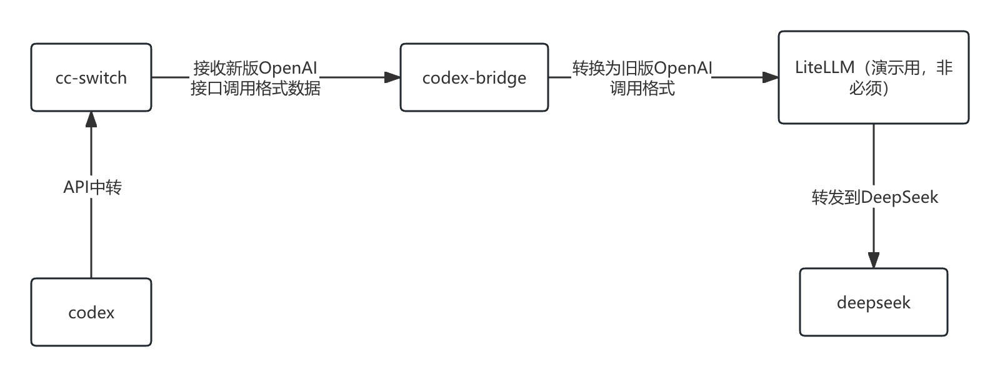

# Codex接入到DeepSeek真的适合吗？有更好的接入工具吗？

## 背景说明

本期视频的主题稍微有点绕，将为大家分享，如何实现将DeepSeek注册到Codex。但是又不建议大家用Codex使用DeepSeek。主要因为用Codex使用DeepSeek不仅不是很兼容，而且非常耗Token。

## deepseek注册到codex原理分析

## 实战演示

前置条件：

- 安装[cc-switch](https://github.com/farion1231/cc-switch)
- 安装[codex-bridge](https://github.com/wujfeng712-ui/codex-bridge)

## 推荐使用DeepSeek的最佳组合

[CodeWhale(DeepSeek-TUI)](https://github.com/Hmbown/CodeWhale)