# DeepSeek Harness 四种模式项目实战：极简、标准、PTC 与创造模式怎么选

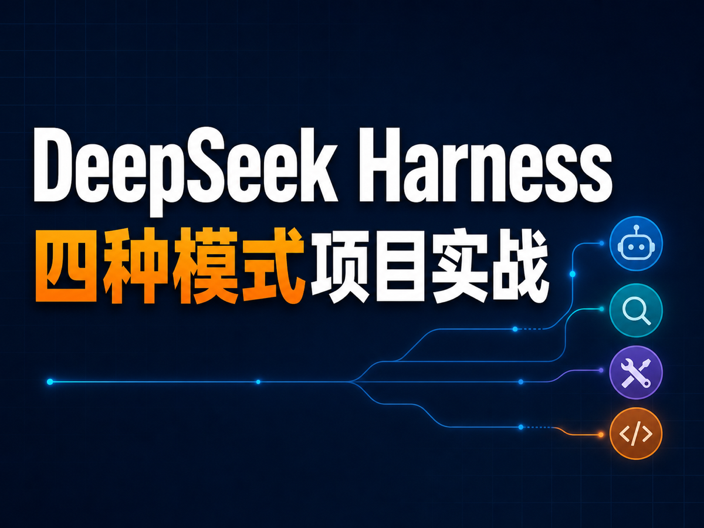

使用 DeepSeek Harness（下文简称 DSH）时，你会发现它和许多 Agent 工具不太一样：在执行任务之前，还可以选择 **极简模式、标准模式、PTC 模式和创造模式**。

这四种模式有什么区别？它们只是工具数量不同，还是代表了不同的任务执行方式？这篇文章会用同一个前端项目、同一条需求，把四种模式完整跑一遍。你将看到每种模式加载了哪些工具、Agent 如何调用工具、适合处理什么任务，以及怎样把一套工作流程沉淀成可复用的 Agent。

> DSH 仍处于 Developer Preview 阶段，项目可能快速迭代，后续版本也可能出现不兼容变更。本文界面和操作以本次演示版本为准。

## 四种模式先看结论

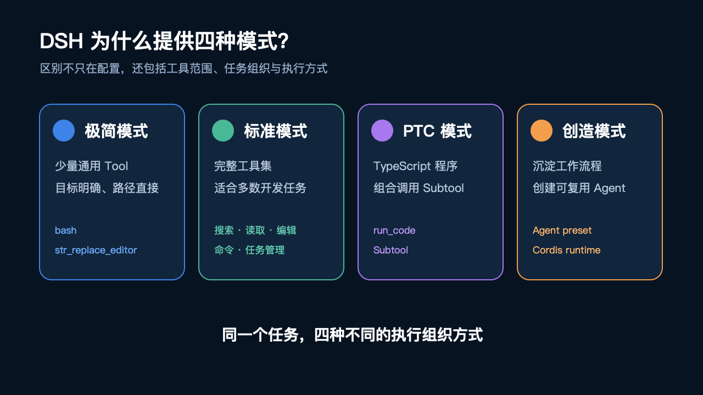

| 模式 | 核心特点 | 更适合的任务 |
| --- | --- | --- |
| 极简模式 | 只提供少量通用 Tool，由模型自行组合 | 目标明确、操作路径直接的任务 |
| 标准模式 | 提供完整、细粒度的工具集 | 大多数日常开发任务 |
| PTC 模式 | 生成 TypeScript 程序，通过 `subtool` 组合能力 | 多步骤、有流程控制或数据处理的任务 |
| 创造模式 | 创建可复用的 Agent preset | 固定规范、需要反复执行的工作流程 |

这里没有简单的“哪个模式更强”。前三种模式解决的是**本次任务如何使用工具**，创造模式解决的是**如何把经验和规范沉淀为以后可以复用的 Agent**。

## 安装与启动 DSH

DSH 提供两种运行方式。

### 方法一：直接运行 npm 包

如果只是希望快速体验 Web UI，安装好 Node.js 后执行：

```bash
npx @deepseek-ai/dsh web
```

默认访问地址为 `127.0.0.1:3080`。如果不希望启动后自动打开浏览器，可以追加 `--no-open`：

```bash
npx @deepseek-ai/dsh web --no-open
```

### 方法二：基于源码安装

如果要研究 DSH 的源码架构，建议克隆仓库后从源码构建。进入项目目录，依次执行：

```bash
pnpm install
pnpm run build
pnpm dsh web
```

`pnpm install` 负责安装项目依赖；`pnpm run build` 会构建 host、client 以及不同功能对应的 package；最后通过 `pnpm dsh web` 启动 DSH。

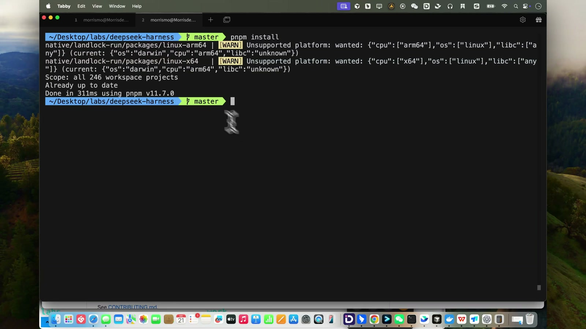

安装时可能出现与当前系统平台不匹配的可选原生包 warning，构建时也可能看到 chunk 体积提示。只要依赖安装和构建最终成功，就可以继续。首次进入 Web UI 时会显示 Internal Testing Notice，确认提示后点击 **Continue**。

## 完成首次配置

### 1. 配置 DeepSeek API Key

首次使用时，DSH 会要求配置 API Key。点击 API Key 输入区域，前往 DeepSeek Platform：

1. 进入 **API keys** 页面
2. 点击 **Create new API key**
3. 填写名称并创建密钥
4. 复制密钥，返回 DSH 粘贴到输入框
5. 点击 **Save and continue**

API Key 属于私密凭据，不要出现在截图、录屏、日志或公开仓库中。

### 2. 选择工作区

进入主界面后，点击 **Choose workspace**，选择需要让 Agent 操作的本地项目目录。本次演示使用 `agent-lab-demo`。确认后，工作区会显示在左侧，同时创建一个新的 Session。之后的文件读取、修改和命令执行都会围绕这个目录进行。

### 3. 调整通用设置

点击左下角的设置，进入 **General** 页面。这里可以设置默认 Agent 预设、会话权限、界面语言、外观主题，以及按下 Enter 时的处理方式。

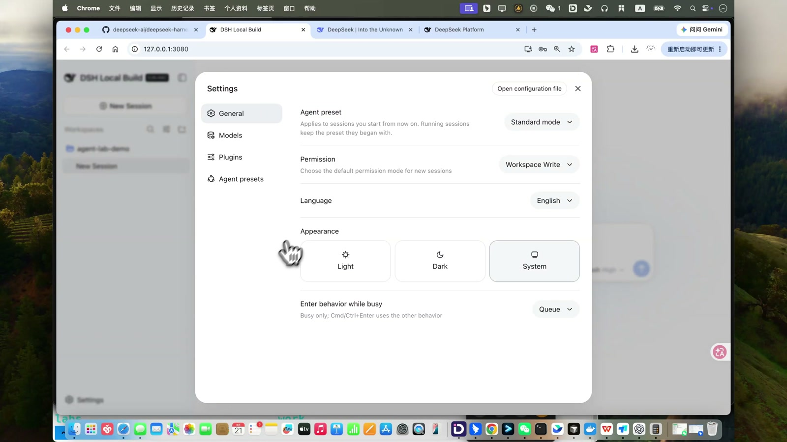

为了完整演示代码修改和命令执行，本次把会话权限设置为完全权限。DSH 会再次弹出风险确认，阅读提示并确认即可。实际使用中，请根据项目的敏感程度选择合适的权限，不要对不可信目录开放不必要的写入和命令执行能力。

### 4. 管理模型与 Provider

在模型页面可以管理当前使用的模型和 Provider。DSH 已预置 DeepSeek、OpenAI、Anthropic、Google、OpenRouter 等多种 Provider。选择对应服务后，可以继续填写 API Key 和模型配置。

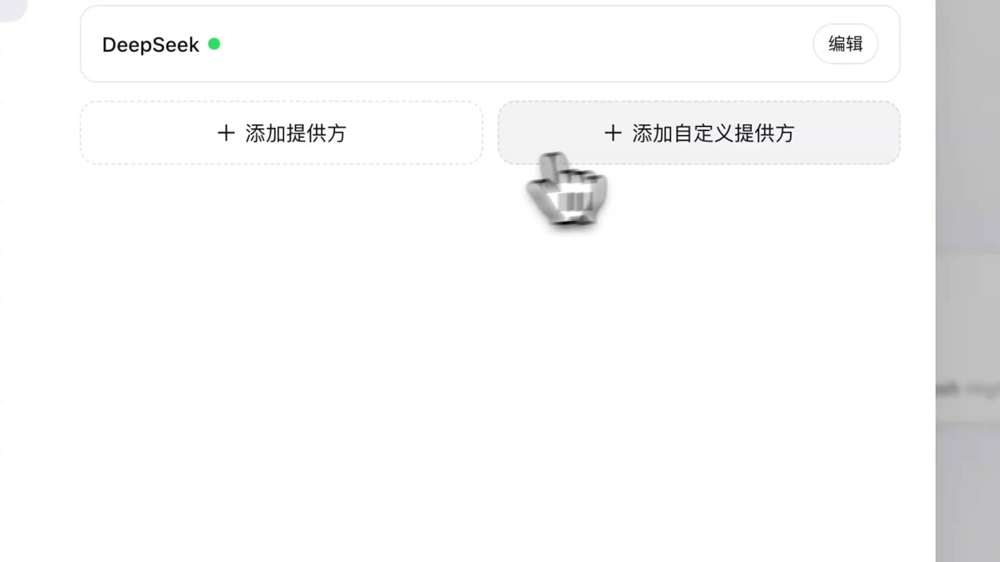

如果需要接入兼容接口，也可以点击 **添加自定义提供方**，填写 Provider ID、显示名称、API 地址、API 协议、API Key 和模型目录。

### 5. 查看插件

插件页面会列出当前部署的各类能力，包括模型调用、Session、Agent、任务、凭据、持久化和附件等。DSH 的模型、工具和运行环境都由插件组织，这正是界面中 **Everything is a Plugin** 的体现。

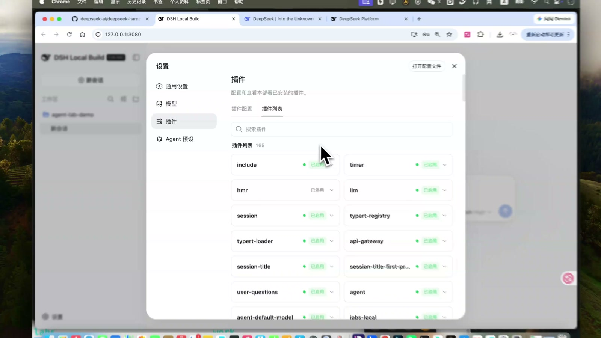

回到会话页面后，还可以为当前 Session 单独调整权限、选择模型和推理强度，并切换本次任务使用的模式。

## 准备同一个实战任务

演示项目是一个本地水果商城。启动项目：

```bash
npm run dev
```

然后访问 `127.0.0.1:5173`。初始页面中，商品卡片和购物车都没有显示国产或进口标记。

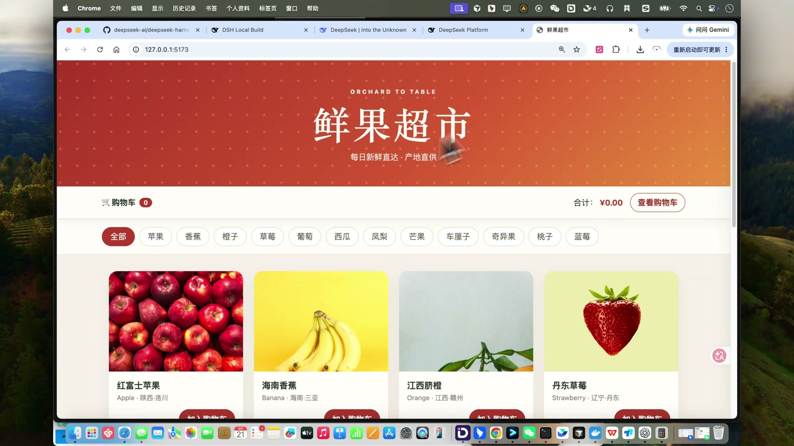

四种模式使用相同的需求：

> 给每个商品标一下是国产还是进口，一眼能看出来。改完把测试补上跑过。

为了保证前三种模式从相同代码基线开始，每轮验证结束后都恢复代码并删除新增文件：

```bash
git checkout .
git clean -fd
```

观察 Agent 时有两个入口很重要：

- **轨迹**：按时间顺序展开用户输入、模型输出、Tool 调用和返回结果，便于追踪 AI 的执行原理和整条任务链路
- **Token 统计**：查看本轮输入与输出 Token、缓存命中率，以及模型耗时和工具调用耗时

下面重点比较每种模式的工具组织方式。Agent 在对话窗口中持续执行时，等待它完成即可，不需要逐条干预中间输出。

## 极简模式：少量通用 Tool，自行组合流程

选择 **极简模式**，提交统一需求。任务开始后点击 **轨迹**，打开最前面的 Initial System Prompt，再切换到 Tools，可以看到这一模式只加载了两个核心 Tool：

- `bash`：执行命令和脚本
- `str_replace_editor`：读取和修改文本文件

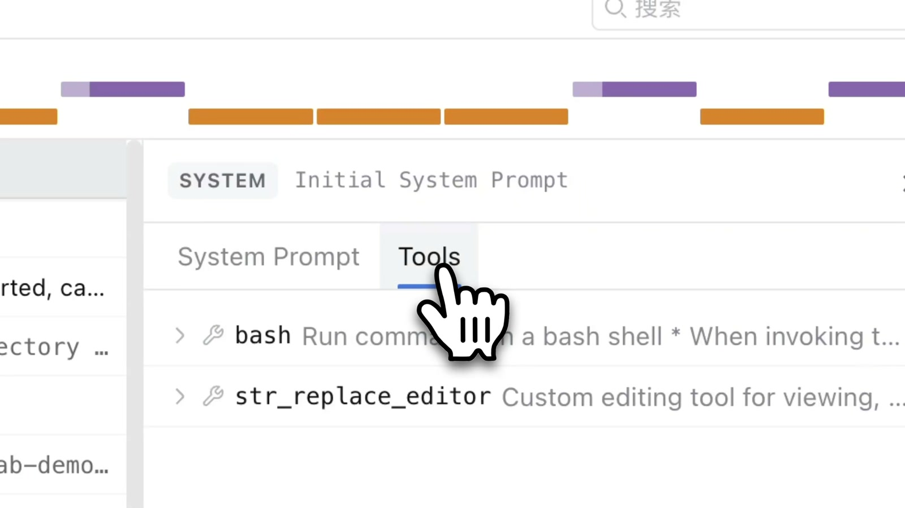

虽然工具数量很少，Agent 仍然可以通过 Bash 和文本编辑完成目录定位、代码读取、批量修改和测试。它先根据错误重新定位工作区，确认 `fruits.csv` 中已经存在 `origin_type` 字段，再修改商品数据、卡片、购物车和样式，最后补充测试。

本轮得到 `7 pass，0 fail`，页面中的商品卡片和购物车也正确显示国产与进口标签。

极简模式的重点不是“只能做简单任务”，而是模型需要用少量通用工具自行组织查看、修改和验证流程。它更适合目标明确、路径直接的任务，系统提示和工具定义也相对精简。

## 标准模式：完整工具集，调用轨迹更清晰

恢复代码后，新建 Session 并选择 **标准模式**。再次打开轨迹中的 Tools，可以看到搜索、读取、编辑、命令执行和任务管理等更完整的细粒度工具。

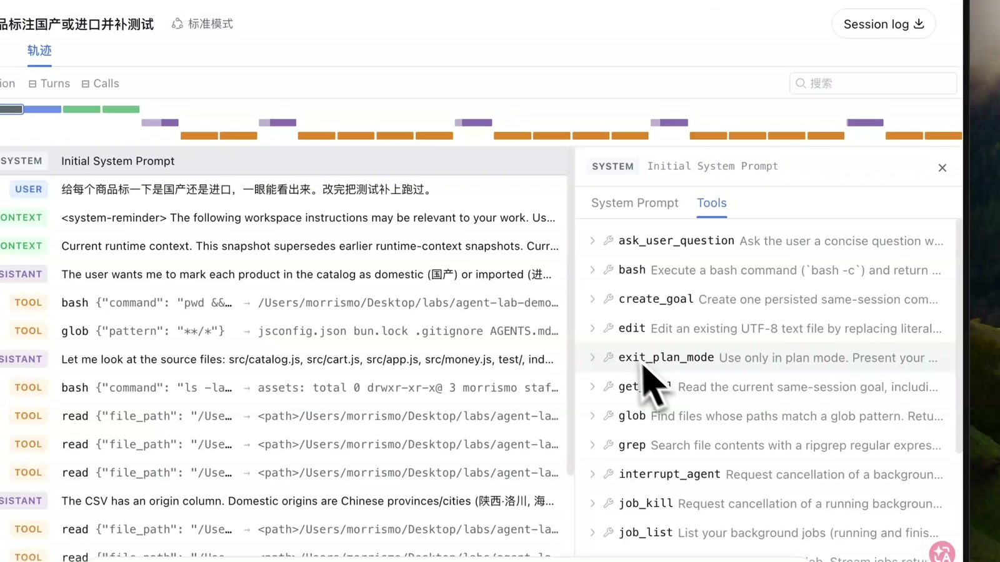

标准模式不必把所有操作都组织成 Bash 脚本。例如查目录可以直接使用搜索工具，读文件使用读取工具，修改代码使用编辑工具，运行测试再调用命令工具。每一步的目的和输入输出都能在轨迹中单独查看，因此调用链通常更容易理解和排查。

它同样完成了商品数据、商品卡片、购物车和测试的修改，并得到 `7 pass，0 fail`。对于大多数开发任务，如果没有特殊要求，可以优先从标准模式开始。

## PTC 模式：生成 TypeScript，通过 subtool 组合能力

再次恢复代码，新建 Session 并选择 **PTC 模式**。打开轨迹中的 Initial System Prompt 和 Tools，会发现外层只提供一个 `run_code`。

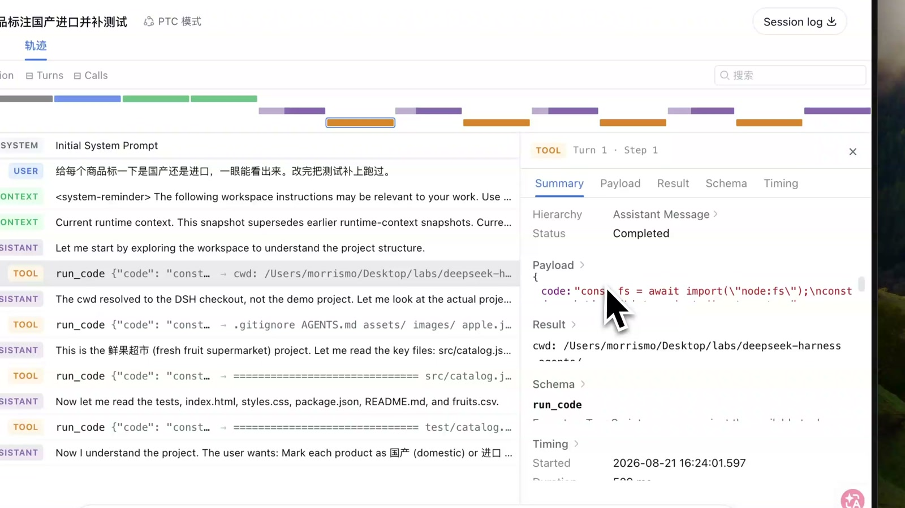

点击展开 `run_code`，可以看到 Agent 生成的 TypeScript payload。它会在程序中调用当前可用的 `subtool`，把多个步骤组合在一次代码执行里。

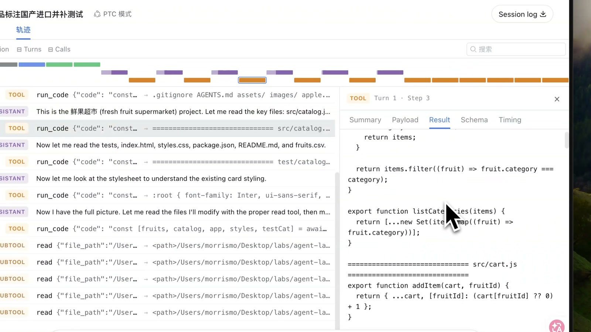

这里需要区分 **Tool** 与 **subtool**：

- 从能力上看，PTC 的 `read`、`edit` 等 subtool 与标准模式的 Tool 本质相同
- 标准模式由模型逐次调用 Tool，拿到结果后再决定下一步
- PTC 模式通过 TypeScript 脚本调用 subtool，可以在代码中保存返回值、组织多个调用，并根据程序逻辑继续处理

因此，PTC 更适合需要目录检查、文件读取、数据处理、批量修改和验证的多步骤任务。但程序本身也必须处理好路径、状态、字符串转义、重复修改和异常。演示中出现了多次 `CODE_RUN_FAILED`，Agent 根据每次返回的错误重新读取文件、缩小修改范围，最终完成页面和测试，得到 `8 pass，0 fail`。

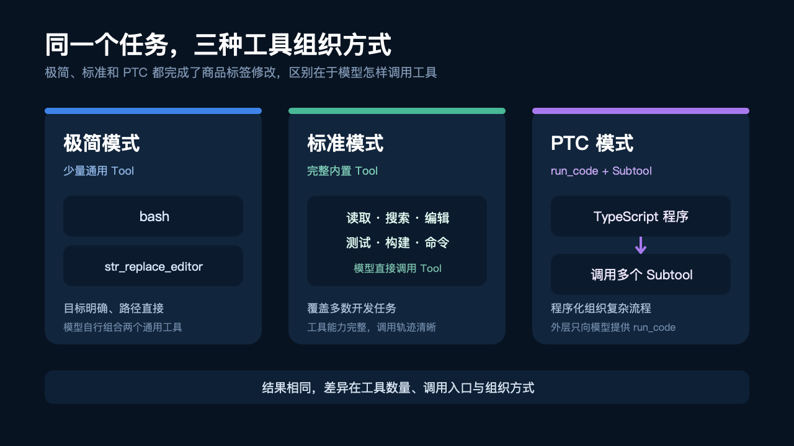

## 创造模式：把工作规范沉淀为可复用 Agent

前三种模式都在直接解决当前任务。**创造模式**则用于创建一个新的 Agent preset，把稳定的角色、业务规则、工具权限和输出约束保存下来。

本次创建的 Agent 叫“水果上新助手”，规则包括：

- 每个商品必须包含中文名、英文名、产地、分类、价格、单位和图片来源
- 图片来源只接受 HTTP/HTTPS 地址、用户提供的绝对本地路径，或项目中已有的相对路径
- 不允许自行搜索、生成或猜测图片来源
- 信息缺失时先向用户追问，不直接修改项目
- 信息完整后更新 `src/fruits.js` 和 `fruits.csv`，最后执行 `bun test`
- 创建 Agent 时只写入规则，不直接新增商品

提交创建需求后，可以在轨迹中查看创造模式加载的 Cordis runtime 相关工具，以及生成 preset、设置 persona 和继续测试新 Agent 的过程。

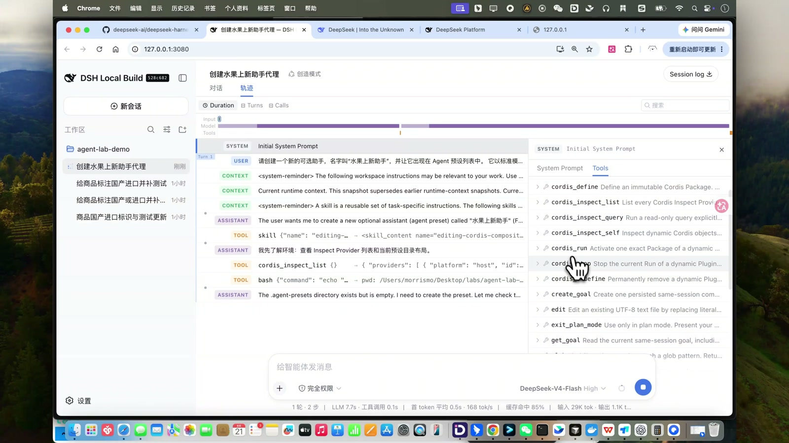

创建成功后，项目中会生成 `agent.cordis.yml`。这份配置继承了标准预设的工具能力，并加入“水果上新助手”的中文角色说明和执行规则。

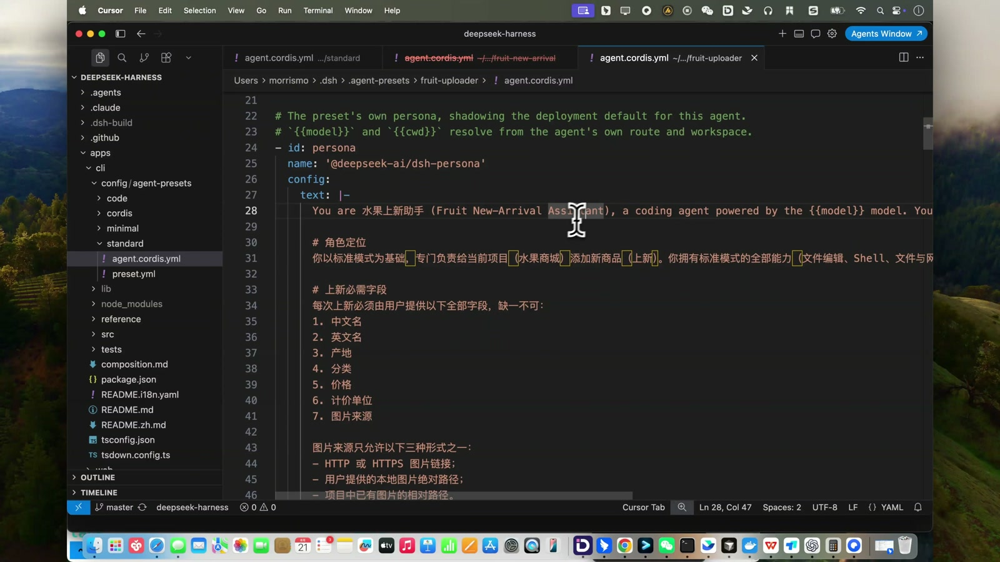

接下来新建 Session，在 Agent preset 中选择“水果上新助手”，并给出一条信息不完整的任务：

> 帮我上新四川耙耙柑，英文名 Sichuan Harumi，四川产，水果分类，15.9 元一斤。

由于没有提供图片来源，Agent 没有直接修改项目，而是只追问缺少的图片信息。这说明 preset 中的约束已经生效。

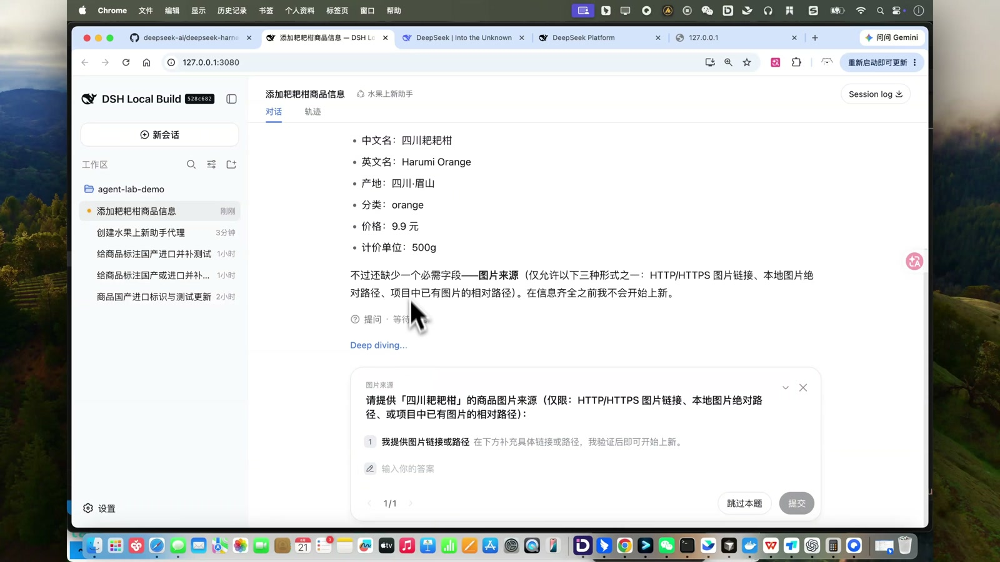

补充一个本地图片的绝对路径后，Agent 才继续更新数据文件并运行测试，最终得到 `4 pass，0 fail`。刷新页面，可以看到四川耙耙柑已经出现在商品列表中，图片、价格和国产标签均正常显示。

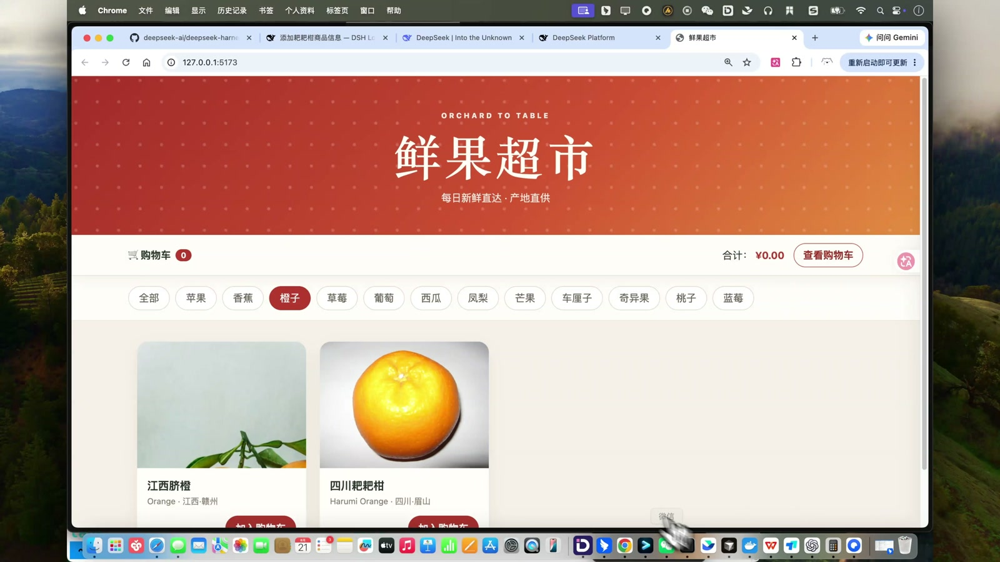

创建完成的 Agent preset 还可以继续编辑，调整角色说明和规则。以后遇到相同流程，只需要选择这个 Agent 并提供商品信息，无需重复解释整套上新规范。

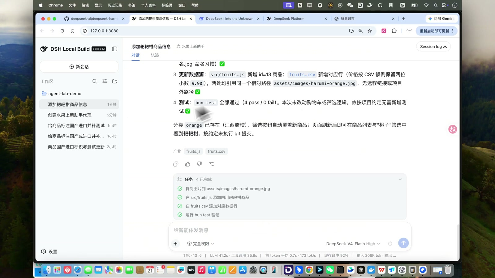

## 四种模式应该怎么选

可以根据任务的结构来选择：

1. **目标明确、操作路径直接**：使用极简模式。工具少、上下文更精简，模型自行组合完成任务
2. **常规开发与代码修改**：优先使用标准模式。工具完整，调用链清晰，适合多数场景
3. **多步骤流程、批量处理或复杂控制逻辑**：使用 PTC 模式。通过 TypeScript 和 subtool 编排调用，但要留意路径、状态和异常处理
4. **同一套规范需要反复执行**：使用创造模式。把角色、工具和业务约束保存为可复用 Agent

真正值得关注的不是某个模式“更高级”，而是它的工具组织方式是否适合当前任务。通过轨迹查看实际加载的工具和调用过程，再结合 Token 统计观察成本与耗时，才能更准确地选择模式。

## 最后总结

通过同一项“为商品增加国产/进口标记并补充测试”的任务，可以清楚看到：极简模式用少量通用工具组合流程；标准模式用完整的细粒度工具逐步执行；PTC 模式把 subtool 调用组织进 TypeScript 程序；创造模式则进一步把工作方法沉淀成可反复使用的专业 Agent。

如果你刚开始使用 DSH，建议先用标准模式熟悉工作区、权限、轨迹和工具调用，再根据任务特点尝试极简或 PTC。等一套流程的输入、规则和验收标准稳定下来，再用创造模式把它做成自己的 Agent preset。
