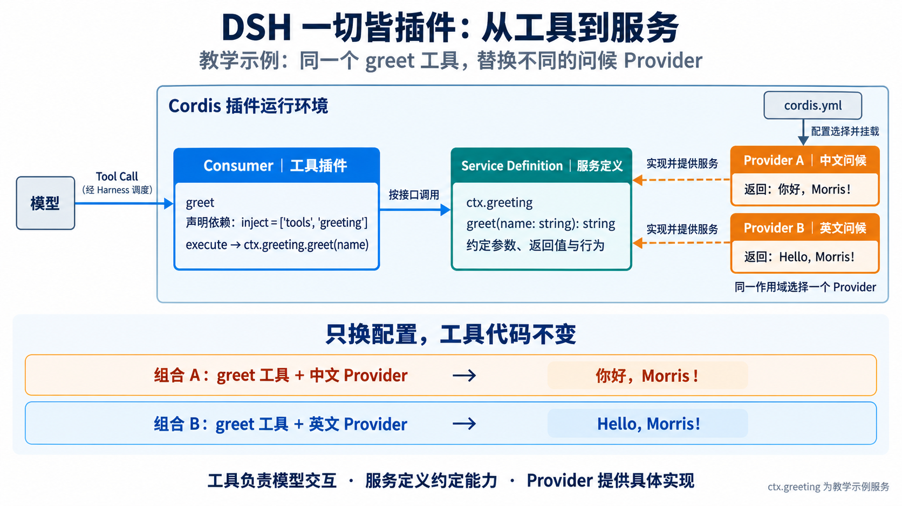
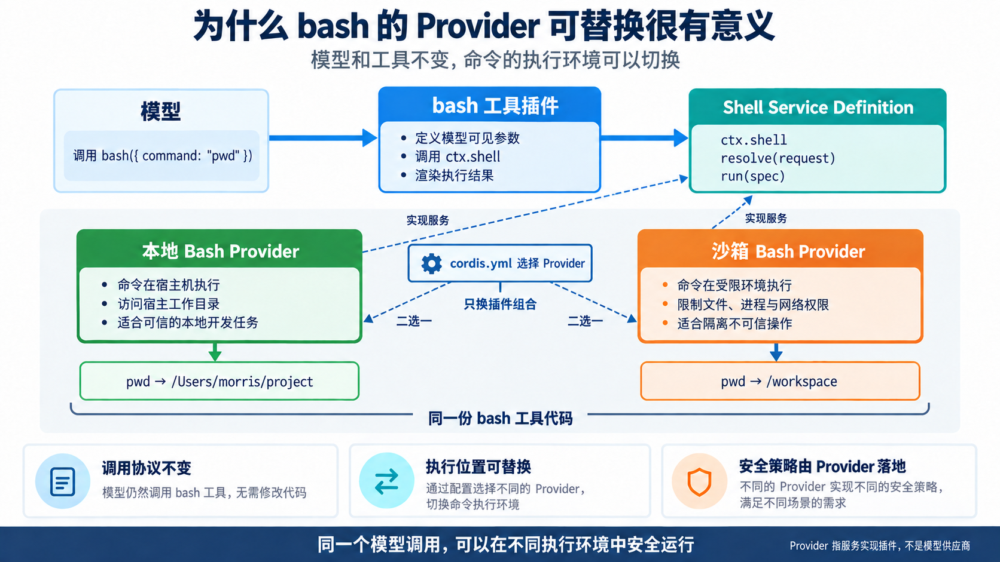

# 从工具到服务：为工具添加可替换的 Provider

DSH 一切皆插件。上一讲中，我们开发了一个可以被模型调用的 `greet` 工具。这一讲继续改造同一个工具：把问候逻辑从工具中取出，定义成 `ctx.greeting` 服务，再为它提供中文和英文两种实现。

完成后，你将理解 Service、Provider 和 Consumer 分别负责什么，`inject` 为什么能够连接插件，以及多个工具或普通插件应当如何复用同一项底层能力。

> 本文中的 Provider 指“服务实现插件”，不是 DeepSeek、OpenAI 等模型供应商，也不等于沙箱。

## 先看最终效果



模型始终发起相同的工具调用：

```json
{
  "name": "greet",
  "arguments": {
    "name": "Morris"
  }
}
```

加载中文 Provider 时，工具返回：

```text
你好，Morris！
```

只把配置中的 Provider 换成英文实现后，同一个工具返回：

```text
Hello, Morris!
```

模型调用方式和 `greet` 工具代码都不需要随语言实现一起变化。

## 一、为什么要把逻辑从工具中拆出来

上一讲的 `greet` 工具直接生成问候语：

```ts
async execute(args) {
  return `Hello, ${args.name}!`
}
```

这种写法适合只在一个地方使用的简单逻辑。如果多个工具和插件都需要生成问候语，它们只能分别实现一遍，或者直接导入某个具体实现。调用方会因此和实现绑定在一起。

把问候能力定义为服务后，依赖关系变成：

```text
模型
  ↓ Tool Call
greet 工具（Consumer）
  ↓ ctx.greeting.greet(name)
Greeting Service Definition
  ↓ 由配置选择一种实现
中文 Provider 或英文 Provider
```

三个角色分别承担不同职责：


| 角色                 | 本文示例           | 职责          |
| ------------------ | -------------- | ----------- |
| Consumer           | `greet` 工具     | 接收模型调用并使用服务 |
| Service Definition | `ctx.greeting` | 约定调用方法和返回值  |
| Service Provider   | 中文或英文实现        | 完成具体的问候逻辑   |


工具并不会调用另一个工具。多个工具如果需要复用问候能力，都应调用 `ctx.greeting` 服务。

## 二、准备目录

继续使用上一讲创建的 `scratch-plugin`，新增三个文件并修改原来的工具：

```text
scratch-plugin/
├── cordis.yml
└── src/
    ├── greeting-service.ts
    ├── greeting-zh.ts
    ├── greeting-en.ts
    ├── greet-tool.ts
    └── tool-logger.ts       # 上一讲的观察插件，可以保留
```

其中：

- `greeting-service.ts` 定义服务接口。
- `greeting-zh.ts` 和 `greeting-en.ts` 提供两种实现。
- `greet-tool.ts` 是服务的消费方。
- `cordis.yml` 决定本次运行选择哪个 Provider。


## 三、定义 Greeting 服务

创建 `scratch-plugin/src/greeting-service.ts`：

```ts
import { Service, type Context } from '@deepseek-ai/cordis'

declare module '@deepseek-ai/cordis' {
  interface Context {
    greeting: GreetingService
  }
}

export abstract class GreetingService extends Service {
  constructor(ctx: Context) {
    super(ctx, 'greeting')
  }

  abstract greet(name: string): string
}
```

这个文件完成两件事。

### 让 TypeScript 认识 `ctx.greeting`

```ts
declare module '@deepseek-ai/cordis' {
  interface Context {
    greeting: GreetingService
  }
}
```

这是 TypeScript 的声明合并。它告诉编译器：Cordis 的 `Context` 上存在一个名为 `greeting` 的服务，其类型是 `GreetingService`。

这段声明只提供类型信息，不会在运行时创建服务。真正创建服务的是稍后加载的 Provider。

### 声明服务名称和方法

```ts
export abstract class GreetingService extends Service {
  constructor(ctx: Context) {
    super(ctx, 'greeting')
  }

  abstract greet(name: string): string
}
```

`super(ctx, 'greeting')` 指定该服务在 Context 上使用 `greeting` 这个名称。具体 Provider 实例化后，其他插件便可以通过 `ctx.greeting` 访问它。

抽象方法规定所有 Provider 都必须实现：

```ts
greet(name: string): string
```

调用方只依赖这个约定，不需要知道当前加载的是中文实现还是英文实现。

## 四、编写中文 Provider

创建 `scratch-plugin/src/greeting-zh.ts`：

```ts
import { GreetingService } from './greeting-service.ts'

export default class ChineseGreeting extends GreetingService {
  greet(name: string): string {
    return `你好，${name}！`
  }
}
```

`ChineseGreeting` 继承 `GreetingService`，因此它必须实现 `greet()`。它也是一个可以由 Cordis Loader 挂载的 Service 类插件。

当配置加载这个文件时，Cordis 创建 `ChineseGreeting`，基类构造函数通过 `super(ctx, 'greeting')` 将实例注册为 `ctx.greeting`。

## 五、编写英文 Provider

创建 `scratch-plugin/src/greeting-en.ts`：

```ts
import { GreetingService } from './greeting-service.ts'

export default class EnglishGreeting extends GreetingService {
  greet(name: string): string {
    return `Hello, ${name}!`
  }
}
```

两个 Provider 实现相同的服务定义：

```text
ChineseGreeting ─┐
                 ├─ 实现 GreetingService ─→ 提供 ctx.greeting
EnglishGreeting ─┘
```

同一个 Cordis 作用域只选择一个 `greeting` Provider。两个实现如果同时挂载，会争用同一个服务名，Cordis 会明确报告重复服务注册。

## 六、让 greet 工具消费服务

把上一讲的 `scratch-plugin/src/greet-tool.ts` 修改为：

```ts
import type { Context } from '@deepseek-ai/cordis'
import { defineTool } from '@deepseek-ai/dsh-tools'
import type {} from './greeting-service.ts'

export const name = 'greet-tool'
export const inject = ['tools', 'greeting']

export function apply(ctx: Context) {
  ctx.tools.register(defineTool({
    name: 'greet',
    description: 'Greet someone by name.',
    parameters: {
      name: {
        type: 'string',
        required: true,
        description: 'The name of the person to greet.',
      },
    },
    output: {
      schema: {
        type: 'string',
      },
      render: (_args, value) => [
        {
          type: 'text',
          text: value,
        },
      ],
    },
    async execute(args) {
      return ctx.greeting.greet(args.name)
    },
  }))
}
```

这次改造只有两个关键变化。

### 导入服务类型

```ts
import type {} from './greeting-service.ts'
```

这行代码让 TypeScript 读取 `greeting-service.ts` 对 `Context` 的类型扩展。它不会加载中文或英文 Provider，也不会在运行时创建 `ctx.greeting`。

### 声明并使用服务依赖

```ts
export const inject = ['tools', 'greeting']
```

工具现在依赖两个服务：

- `tools`：用于注册模型能够调用的 `greet` 工具。
- `greeting`：用于执行具体的问候逻辑。

Cordis 会等待这两个服务全部存在，然后执行工具插件的 `apply()`。因此，在 `execute()` 中可以直接使用：

```ts
return ctx.greeting.greet(args.name)
```

如果没有加载 Greeting Provider，`greet-tool` 会保持 `PENDING`，不会注册一个执行到一半才报错的工具。Provider 在运行期间被卸载时，依赖它的工具插件也会卸载；服务恢复后，工具插件会重新激活。

## 七、通过配置选择中文 Provider

更新 `scratch-plugin/cordis.yml`。将路径替换为本机仓库的绝对路径：

```yaml
- insert:
    - id: greeting-provider
      name: '/absolute/path/to/deepseek-harness/scratch-plugin/src/greeting-zh.ts'

    - id: greet-tool
      name: '/absolute/path/to/deepseek-harness/scratch-plugin/src/greet-tool.ts'

    - id: tool-logger
      name: '/absolute/path/to/deepseek-harness/scratch-plugin/src/tool-logger.ts'
```

如果没有保留上一讲的 `tool-logger.ts`，删除配置中的 `tool-logger` 行即可。它只负责观察工具结果，不影响 Service 和 Provider 的运行。

这里不需要把 `greeting-service.ts` 单独写进配置。它负责定义类型和基类；真正提供 `ctx.greeting` 的插件是 `greeting-zh.ts`。

在仓库根目录启动：

```bash
pnpm dsh web --patch ./scratch-plugin/cordis.yml
```

如果已有 DSH Web 实例占用了 `3080` 端口，可以先停止旧实例，或者临时选择另一个端口：

```bash
pnpm dsh web --patch ./scratch-plugin/cordis.yml --port 3099
```

打开终端打印的 Web 地址，然后向模型发送：

```text
请使用 greet 工具问候 Morris。
```

预期工具结果为：

```text
你好，Morris！
```


## 八、只替换 Provider

保持 `greet-tool.ts` 不变，把配置中的 Provider 路径改成英文实现：

```yaml
- insert:
    - id: greeting-provider
      name: '/absolute/path/to/deepseek-harness/scratch-plugin/src/greeting-en.ts'

    - id: greet-tool
      name: '/absolute/path/to/deepseek-harness/scratch-plugin/src/greet-tool.ts'

    - id: tool-logger
      name: '/absolute/path/to/deepseek-harness/scratch-plugin/src/tool-logger.ts'
```

重新发起同样的工具调用，预期结果变为：

```text
Hello, Morris!
```

这次变化发生在 Provider，而不是模型接口或工具实现中：


| 保持不变                          | 发生变化              |
| ----------------------------- | ----------------- |
| 工具名 `greet`                   | `greeting` 服务的实现  |
| 参数 `{ name: string }`         | 问候语的生成方式          |
| 输出类型 `string`                 | 具体返回文本            |
| `ctx.greeting.greet(name)` 调用 | 配置加载的 Provider 文件 |

## 九、根据条件自动选择 Provider

上一节通过修改配置文件来切换 Provider。也可以把中文和英文 Provider 都写进配置，再根据环境变量决定本次启动加载哪一个：

```yaml
- insert:
    - id: greeting-zh
      name: '/absolute/path/to/deepseek-harness/scratch-plugin/src/greeting-zh.ts'
      disabled: !!js (process.env.GREETING_LANGUAGE ?? 'zh') !== 'zh'

    - id: greeting-en
      name: '/absolute/path/to/deepseek-harness/scratch-plugin/src/greeting-en.ts'
      disabled: !!js (process.env.GREETING_LANGUAGE ?? 'zh') !== 'en'

    - id: greet-tool
      name: '/absolute/path/to/deepseek-harness/scratch-plugin/src/greet-tool.ts'

    - id: tool-logger
      name: '/absolute/path/to/deepseek-harness/scratch-plugin/src/tool-logger.ts'
```

`!!js` 让 Cordis Loader 在每次决定是否挂载该配置项时计算表达式。对于 `disabled`：

- 结果为 `false`，加载这个插件。
- 结果为 `true`，跳过这个插件。

没有设置 `GREETING_LANGUAGE` 时，表达式使用默认值 `zh`，因此只加载中文 Provider。要改用英文 Provider，可以这样启动：

```bash
GREETING_LANGUAGE=en pnpm dsh web --patch ./scratch-plugin/cordis.yml
```

选择过程如下：

```text
读取 GREETING_LANGUAGE
        ↓
分别计算两行 disabled
        ↓
只挂载一个 Greeting Provider
        ↓
注册唯一的 ctx.greeting
        ↓
greet-tool 的 inject 得到满足并激活
```

不同取值对应的结果为：

| `GREETING_LANGUAGE` | 中文 Provider | 英文 Provider | 结果 |
| --- | --- | --- | --- |
| 未设置或 `zh` | 加载 | 跳过 | 返回中文问候 |
| `en` | 跳过 | 加载 | 返回英文问候 |
| 其他值，例如 `fr` | 跳过 | 跳过 | `ctx.greeting` 不存在，`greet-tool` 保持 `PENDING` |

这里的两个配置项分别使用 `greeting-zh` 和 `greeting-en` 作为 `id`，因为它们同时存在于同一份配置中。上一节只有一个 Provider 配置项，所以可以使用稳定的 `greeting-provider` 作为 `id`，只替换它的 `name`。

不能让两个 Provider 同时启用。它们都会尝试在同一个作用域注册 `ctx.greeting`，Cordis 会报告服务重复。条件判断的作用不是让消费方在两个实现中随机选择，而是确保启动时只挂载一个实现。

这个例子用两个 Provider 演示条件化的插件组合。如果实际项目只需要切换问候语言，也可以给一个 Provider 增加语言配置；当两个实现还存在运行环境、依赖或生命周期差异时，拆成两个 Provider 更合适。

## 十、多个插件如何复用同一项服务

Service 的价值不只在于替换实现。假设后续还有欢迎工具、邮件插件和通知插件，它们都可以声明 `inject = ['greeting']`，然后调用同一个服务：

```text
welcome 工具 ─┐
email 插件 ───┼─→ ctx.greeting ─→ 当前选中的 Greeting Provider
notice 插件 ──┘
```

这些插件复用的是问候能力，不是互相调用工具。Provider 只实现 `greeting` 这一项服务，也不是面向所有工具的万能插件。

实际开发中，只有当一项能力需要被多个调用方使用、存在可替换实现，或者需要独立管理生命周期时，才值得定义 Service。只在一个工具内部使用的简单计算，直接保留在工具或普通函数里更清楚。

## 十一、映射到 DSH 的 bash 工具

`greet` 便于看懂代码，但更能体现这种拆分价值的是 DSH 的 `bash` 工具。



真实关系可以简化为：

```text
模型
  ↓ 调用 bash 工具
bash 工具
  ↓ ctx.shell.resolve(...) / ctx.shell.run(...)
Shell Service Definition
  ↓ 配置选择实现
本地 Bash Provider 或沙箱 Bash Provider
```

模型始终调用 `bash`，工具始终使用 `ctx.shell`。Provider 决定命令具体怎样执行：本地实现可以直接使用宿主机工作目录，沙箱实现会在执行过程中加入文件、进程等限制。

这里的沙箱不是 Provider 的同义词。沙箱是一项隔离能力；沙箱 Bash Provider 是使用这项能力实现 `ctx.shell` 的具体插件。将来即使出现远程机器或容器中的 Shell Provider，`bash` 工具仍可以沿用相同的调用接口。

## 十二、记住三个名字

这个示例中有三个容易混淆的名称：


| 名称                  | 谁使用它      | 作用                       |
| ------------------- | --------- | ------------------------ |
| `greet`             | 模型        | 发起 Tool Call 时使用的工具名     |
| `greeting`          | 插件代码      | 通过 `ctx.greeting` 调用的服务名 |
| `greeting-provider`、`greeting-zh`、`greeting-en` | Cordis 配置 | 标识一条 Provider 配置；同时写入多个实现时，每条配置使用不同的 ID |


可以用一条调用链记住整讲内容：

```text
模型调用工具 → 工具消费服务 → Provider 实现服务 → 配置选择 Provider
```


## 最后总结

工具插件负责模型交互，包括参数定义、结果校验和内容渲染；Service Definition 约定代码如何调用一项能力；Provider 完成这项能力的具体实现。

把公共能力放到 Service 后，多个工具和普通插件可以通过同一个 `ctx` 服务复用它。配置可以替换 Provider，而消费方继续使用稳定的服务接口。这就是 DSH “一切皆插件”从添加一个工具继续走向可组合、可替换能力的关键一步。
