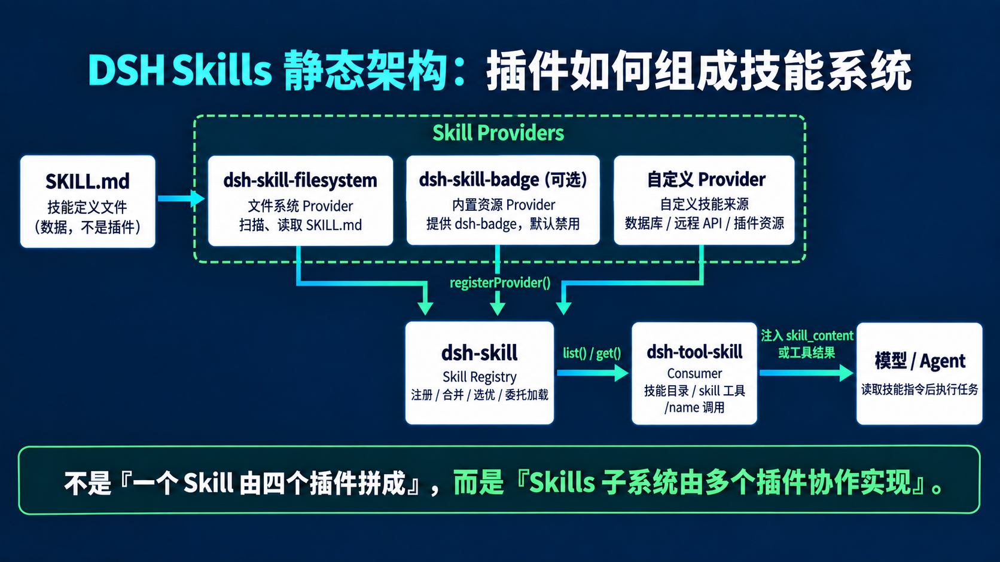

# DSH Skills 工作原理与实战

DSH 的技能能力不是由一个插件单独完成的。它由技能提供方、技能注册表和技能消费方共同组成：提供方负责技能来自哪里，`dsh-skill` 负责管理和定位技能，`dsh-tool-skill` 负责把技能交给用户和模型使用。

## 一、整体架构



整条链路可以概括为：

```text
技能数据
  │
  ├── 用户目录中的 SKILL.md
  ├── 项目目录中的 SKILL.md
  ├── 插件内置技能
  └── 自定义或远程技能
          │
          ▼
技能提供方
  │
  ├── dsh-skill-filesystem
  ├── dsh-skill-badge
  └── 自定义提供方
          │
          │ registerProvider()
          ▼
dsh-skill
  │
  ├── 注册提供方
  ├── 收集技能目录
  ├── 处理同名技能
  ├── 选择胜出候选项
  └── 把加载请求交还给具体提供方
          │
          │ list() / get()
          ▼
dsh-tool-skill
  │
  ├── 发布技能目录
  ├── 提供 skill 工具
  └── 处理 /名称 直接调用
          │
          ▼
模型读取技能指令
          │
          ├── 直接回答
          └── 继续调用其他工具
```

这里的核心不是“一个技能由四个插件拼起来”，而是“多个插件协作实现了完整的技能系统”。

## 二、四个插件分别负责什么


### 1. `dsh-skill-filesystem`：文件系统技能提供方

`dsh-skill-filesystem` 本质上是一种技能供应商。它负责从磁盘发现和加载技能。

它主要完成以下工作：

- 扫描用户目录和项目目录中的技能文件。
- 解析 `SKILL.md` 的名称、描述和调用策略。
- 在发现阶段返回轻量的技能候选项。
- 在某个技能真正被选择时重新读取完整正文。
- 监听目录变化，并通知注册表清除旧目录缓存。

它不负责决定模型是否应该使用某个技能，也不负责向模型注册工具。

### 2. `dsh-skill-badge`：插件内置技能提供方

`dsh-skill-badge` 也是一种技能提供方。它和文件系统提供方实现相同的提供方接口，但技能来源不同。

```text
dsh-skill-filesystem
└── 从磁盘上的 SKILL.md 提供技能

dsh-skill-badge
└── 从插件自带资源提供 dsh-badge 技能
```

对 `dsh-skill` 来说，两者没有本质区别。注册表只关心它们是否实现了统一的提供方接口。

基础组合默认禁用 `dsh-skill-badge`，因此它是一个可选提供方。

### 3. `dsh-skill`：注册表和调度中心

`dsh-skill` 是整个技能系统的中心服务。它公开 `ctx.skills`，统一管理所有技能提供方。

它负责：

- 注册和注销提供方。
- 按当前工作目录和智能体作用域收集候选项。
- 校验候选项是否合法。
- 解决同名技能冲突。
- 缓存完整且稳定的技能目录。
- 根据技能名称找到胜出的候选项。
- 把正文加载请求委托给该候选项所属的提供方。
- 校验提供方返回的完整技能定义。

它不负责：

- 扫描目录。
- 打开 `SKILL.md`。
- 解析具体数据源。
- 注册模型工具。
- 执行技能正文。

因此，把它叫作“代理”只能表达一部分含义。更准确的说法是：`dsh-skill` 是技能提供方的注册表、目录合并器和加载调度中心。

### 4. `dsh-tool-skill`：用户和模型的技能入口

`dsh-tool-skill` 是技能系统的消费方。它不关心技能来自哪个提供方，只调用 `ctx.skills.list()`、`ctx.skills.snapshot()` 和 `ctx.skills.get()`。

它负责三件事：

1. 把可用技能的名称和描述发布到模型上下文。
2. 注册供模型调用的 `skill` 工具。
3. 识别用户直接输入的 `/技能名称`，并在模型请求前加载技能。

它把注册表能力转换成用户和模型真正能使用的入口。

## 三、什么样的对象才算技能提供方

一个技能提供方至少需要实现三个成员：

```ts
interface SkillProvider {
  readonly name: string

  readonly list: (
    options: SkillLookupOptions,
  ) => Promise<readonly SkillCandidate[] | SkillProviderObservation>

  readonly get: (
    candidate: SkillCandidate,
    options: SkillLookupOptions,
  ) => Promise<SkillDefinition | undefined>
}
```

三个成员分别表示：


| 成员       | 作用                    |
| -------- | --------------------- |
| `name`   | 提供方在注册表中的唯一名称。        |
| `list()` | 发现当前可以提供哪些技能，返回轻量候选项。 |
| `get()`  | 根据之前返回的候选项加载完整技能正文。   |


`list()` 返回的不是完整正文，而是类似下面的候选项：

```ts
{
  name: 'friendly-greeting',
  description: '生成一段友好的中文问候。',
  invocation: {
    modelInvocable: true,
    userInvocable: true,
  },
  source: 'user-dsh',
  provider: 'filesystem',
  rank: 400,
  locator: {
    path: '/Users/example/.dsh/skills/friendly-greeting/SKILL.md',
  },
}
```

其中 `locator` 是提供方自己的定位信息。注册表不解释它，只负责保存；候选项胜出后，注册表再把它原样交回同一个提供方的 `get()`。

## 四、启动阶段：提供方怎样注册

插件启动时，提供方调用：

```ts
ctx.skills.registerProvider(control => provider)
```

文件系统提供方的注册逻辑可以简化为：

```ts
export const inject = ['skills']

export function apply(ctx: Context, config: Config) {
  ctx.skills.registerProvider(control => {
    return new FileSystemSkillProvider(ctx, control, config)
  })
}
```

注册过程如下：

```text
提供方插件启动
      ↓
调用 ctx.skills.registerProvider()
      ↓
dsh-skill 创建 control
      ↓
执行提供方工厂函数
      ↓
取得 Provider 对象和名称
      ↓
检查同一层是否重名
      ↓
记录注册顺序并保存 Provider
      ↓
返回 disposer
```

`control` 提供两个重要能力：

```ts
interface SkillProviderControl {
  readonly signal: AbortSignal
  readonly invalidate: () => void
}
```

- `control.signal`：提供方被注销时触发，用于停止文件监听或远程请求。
- `control.invalidate()`：技能目录发生变化时调用，用于清空目录缓存并通知消费方重新获取。

需要注意：文件系统提供方在启动时注册的是自己，不会立刻把所有 `SKILL.md` 正文注册进去。真正的技能发现发生在后续的 `list()` 调用中。

## 五、发现阶段：怎样得到统一技能目录

当 `dsh-tool-skill` 或其他消费方需要技能目录时，会调用：

```ts
await ctx.skills.list({
  cwd,
  scope: agent,
  signal,
})
```

`dsh-skill` 内部执行：

```text
接收 cwd 和当前 agent scope
          ↓
查找 global 层和当前 scope 链
          ↓
调用每一层中的 Provider.list()
          ↓
收集所有 SkillCandidate
          ↓
校验名称、描述、调用策略、rank 和 provider 字段
          ↓
在同一层内解决重名
          ↓
在不同 scope 层之间覆盖
          ↓
得到每个名称唯一的胜出候选项
          ↓
按名称排序并返回 SkillSummary[]
```


### 同一层怎样选优

同一层出现同名技能时，依次比较：

1. `rank` 越小，优先级越高。
2. `rank` 相同时，越早注册的提供方优先。
3. 仍然相同时，提供方返回列表中越靠前的候选项优先。


### 不同作用域怎样选优

注册表先处理全局层，再处理当前智能体的作用域链。距离当前智能体越近的层越晚合并，因此同名候选项会覆盖较远层的候选项。

```text
global
  ↓ 可以被覆盖
父 scope
  ↓ 可以被覆盖
当前 agent scope
```


### 目录怎样缓存

缓存键由下面的信息组成：

```text
cwd + scope chain + revision
```

只有完整并且收集期间没有发生版本变化的目录才会缓存。提供方调用 `control.invalidate()` 后，注册表会：

```text
revision + 1
      ↓
清空目录缓存
      ↓
发出 skills/change
```


## 六、加载阶段：怎样取得技能正文

当消费方调用：

```ts
await ctx.skills.get('friendly-greeting', options)
```

注册表执行：

```text
校验名称是否符合 kebab-case
          ↓
读取或重新收集合并目录
          ↓
找到 friendly-greeting 的胜出候选项
          ↓
取得候选项所属的 Provider
          ↓
调用 Provider.get(candidate, options)
          ↓
Provider 根据 locator 加载正文
          ↓
dsh-skill 校验 SkillDefinition
          ↓
确认返回名称与候选项名称一致
          ↓
返回完整技能
```

关键调用是：

```ts
match.provider.get(match.candidate, options)
```

对于文件系统提供方，这一步才会真正读取 `SKILL.md`。对于 Badge 提供方，这一步会返回插件自带的技能内容。对于远程提供方，这一步可以发起远程请求。

注册表不缓存完整正文。每次调用 `get()`，都会让胜出的提供方重新加载当前内容。

## 七、`dsh-tool-skill` 提供的两种调用路径


### 路径一：用户显式输入 `/名称`

用户输入：

```text
/friendly-greeting 请演示这个技能
```

执行流程：

```text
用户消息进入 agent/pre-step
          ↓
dsh-tool-skill 扫描直接用户消息
          ↓
识别 /friendly-greeting
          ↓
ctx.skills.get('friendly-greeting')
          ↓
dsh-skill 找到胜出 Provider
          ↓
Provider.get(candidate)
          ↓
返回 SkillDefinition.content
          ↓
包装成 <skill_content>
          ↓
追加 skill-invocation 上下文消息
          ↓
模型收到原始用户消息和完整技能指令
```

这条路径在模型请求发出前完成，所以不会产生：

```text
tool/call: skill
```

轨迹里会看到 `skill-invocation` 上下文，而不是工具调用。

### 路径二：模型自主调用 `skill` 工具

用户输入普通文本：

```text
请使用 friendly-greeting 技能演示一次。
```

执行流程：

```text
dsh-tool-skill 调用 ctx.skills.snapshot()
          ↓
把允许模型调用的技能名称和描述写入目录
          ↓
模型读取目录并选择 friendly-greeting
          ↓
模型发起 tool/call: skill
          ↓
dsh-tool-skill.execute()
          ↓
ctx.skills.get('friendly-greeting')
          ↓
dsh-skill 找到胜出 Provider
          ↓
Provider.get(candidate)
          ↓
tool/result 返回 <skill_content>
          ↓
模型读取技能指令并继续执行任务
```

这条路径在轨迹里会显示：

```text
tool/call: skill
tool/result: <skill_content>...</skill_content>
```


## 八、为什么输入 `/名称` 能在界面中显示

这里包含三层不同的显示机制。

### 1. 输入 `/` 时显示候选菜单

浏览器端的 `ui-skill` 注册了一个 `/` 输入源，并通过 `skills/list` 获取当前会话可见的技能。

用户选择候选项后，前端只会向输入框写入普通文本：

```ts
return { text: `/${candidate.name} ` }
```


### 2. 已发送消息显示为技能标签

消息正文仍然保存普通文本 `/friendly-greeting`。界面根据文本格式把 `/名称` 装饰成技能标签；这只是展示效果，不改变发送给模型的文本。

### 3. 轨迹显示技能注入记录

`dsh-tool-skill` 加载技能后，会创建带来源信息的上下文消息：

```ts
{
  kind: 'skill-invocation',
  name: 'friendly-greeting',
  form: 'instructions',
}
```

轨迹页面读取 `source.kind`。当它等于 `skill-invocation` 时，界面把 `source.name` 显示为该上下文的标签。

因此，轨迹不是解析 `<skill_content>` 来猜测技能名称，而是直接读取持久化的结构化来源信息。

## 九、最终到底执行了什么

技能加载完成后，DSH 只是把正文交给模型：

```xml
<skill_content name="friendly-greeting">
  <skill_resources>
    ...
  </skill_resources>

  <skill_instructions>
    这里是 SKILL.md 的正文
  </skill_instructions>
</skill_content>
```

接下来由模型决定怎样遵循这些指令。

如果技能要求：

```text
用三行中文问候用户。
```

模型可以直接生成回答。

如果技能要求：

```text
读取 package.json 并分析依赖。
```

模型会继续调用文件工具，然后根据读取结果回答。

所以完整关系是：

```text
Provider 提供技能
        ↓
dsh-skill 管理和定位技能
        ↓
dsh-tool-skill 把技能交给模型
        ↓
模型遵循指令完成任务
```


## 十、实战：创建全局技能

用户级全局技能位于：

```text
$DSH_HOME/skills
```

如果没有设置 `DSH_HOME`，默认使用：

```text
~/.dsh/skills
```

创建目录：

```sh
mkdir -p "${DSH_HOME:-$HOME/.dsh}/skills/friendly-greeting"
```

创建文件：

```text
${DSH_HOME:-$HOME/.dsh}/skills/friendly-greeting/SKILL.md
```

文件内容：

```markdown
---
name: friendly-greeting
description: 生成带有明确标记的中文问候，用于测试、演示或验证 DSH 是否成功加载并遵循全局技能。
---

# 友好问候

请使用中文严格输出下面三行，并把占位符替换为当前值：

```text
✅ friendly-greeting 技能已生效
你好，<用户名>！
当前项目：<当前工作目录的最后一级名称>
```

如果无法取得用户名，请使用“朋友”。请直接从当前工作目录判断项目名称，不要仅为此运行命令。不要添加开场说明、结束语或 Markdown 代码围栏。

```


```

### 测试 `/名称` 路径

```sh
pnpm dsh --profile headless "/friendly-greeting 请演示这个技能"
```

实际响应：

```text
✅ friendly-greeting 技能已生效
你好，朋友！
当前项目：deepseek-harness
```

这次运行没有 `tool/call`，因为技能在模型请求前已经注入。

### 测试模型工具路径

```sh
pnpm dsh --profile headless "请使用 friendly-greeting 技能演示一次，并严格遵守技能指令。"
```

这次运行的会话日志会出现：

```text
tool/call: skill
tool/result
```

两次运行可以产生相同回答，但内部调用路径不同。

## 十一、自定义技能提供方：编写并接入 DSH

如果只是增加一份本地技能，直接创建 `SKILL.md` 即可，不需要编写新的提供方。只有当技能来自数据库、远程服务、插件内置资源或其他特殊数据源时，才需要自定义提供方。

下面沿用前面教程中的 `scratch-plugin` 目录，创建一个可以实际加载的内存提供方：

```text
scratch-plugin/
├── cordis.yml
└── src/
    └── example-skill-provider.ts
```

创建 `scratch-plugin/src/example-skill-provider.ts`：

```ts
import type { Context } from '@deepseek-ai/cordis'
import type {
  SkillDefinition,
  SkillProvider,
} from '@deepseek-ai/dsh-skill'

const provider: SkillProvider = {
  name: 'example-skills',

  async list() {
    return [{
      name: 'example-skill',
      description: '处理一个示例任务。',
      invocation: {
        modelInvocable: true,
        userInvocable: true,
      },
      source: 'example',
      provider: 'example-skills',
      rank: 300,
      locator: 'example-skill',
    }]
  },

  async get(candidate): Promise<SkillDefinition | undefined> {
    if (candidate.locator !== 'example-skill') {
      return undefined
    }

    return {
      ...candidate,
      content: '你正在执行 example-skill。回答必须以“自定义 Provider 已生效：”开头，然后简要回应用户请求。',
    }
  },
}

export const inject = ['skills']

export function apply(ctx: Context): void {
  ctx.skills.registerProvider(() => provider)
}
```

`SkillProvider` 类型会检查 `name`、`list()` 和 `get()` 是否满足注册表接口。Cordis 把当前上下文传给 `apply(ctx)`，插件再通过 `ctx.skills.registerProvider()` 注册提供方。

这个对象能成为技能提供方，是因为它满足以下条件：

- 有唯一的 `name`。
- `list()` 能返回合法候选项。
- 候选项的 `provider` 与提供方名称一致。
- `get()` 能根据胜出候选项返回完整定义。
- 插件通过 `ctx.skills.registerProvider()` 完成注册。

如果技能目录会发生变化，提供方还应保存注册时收到的 `control`，并在变化后调用 `control.invalidate()`。

### 通过 `scratch-plugin/cordis.yml` 加载

Provider 文件存在并不代表 DSH 会自动加载它。必须把 TypeScript 文件作为 Cordis 插件写入临时 patch。

编辑 `scratch-plugin/cordis.yml`，在现有 YAML 顶层列表中追加：

```yaml
- insert:
    - id: example-skill-provider
      name: '/absolute/path/to/deepseek-harness/scratch-plugin/src/example-skill-provider.ts'
```

把 `name` 替换为本机源码仓库的绝对路径。沿用已有 `scratch-plugin/cordis.yml` 时，如果文件中已经存在一个 `insert`，也可以把 `example-skill-provider` 加入该 `insert` 的插件列表，不需要再创建第二个 `insert`。

在仓库根目录启动 Web：

```sh
pnpm dsh web --patch ./scratch-plugin/cordis.yml
```

源码启动器通过 `tsx` 的 ESM 加载器直接执行 `.ts` 插件，因此这个开发流程不要求先生成 `lib/`。如果端口 `3080` 已被占用，可以追加 `--port 3099`。

### 验证自定义提供方

打开终端打印的 Web 地址，使用 `/名称` 路径确定性加载技能：

```text
/example-skill 请介绍一下你自己
```

回答应当以这段文字开头：

```text
自定义 Provider 已生效：
```

这证明下面的链路已经贯通：

```text
profile 加载插件
      ↓
example-skills Provider 注册
      ↓
Provider.list() 返回 example-skill
      ↓
/example-skill 触发 ctx.skills.get()
      ↓
Provider.get() 返回正文
      ↓
模型遵循正文要求回答
```

也可以测试模型自主选择路径：

```text
请使用 example-skill 技能介绍一下你自己
```

这条路径应在轨迹中出现 `tool/call: skill` 和对应的 `tool/result`。

### 自定义提供方与普通 `SKILL.md` 的选择


| 需求            | 推荐方式                                        |
| ------------- | ------------------------------------------- |
| 增加一份个人或项目技能   | 创建 `SKILL.md`，复用 `dsh-skill-filesystem`。    |
| 从数据库动态列出技能    | 编写自定义 Provider。                             |
| 从远程接口加载技能     | 编写自定义 Provider，并在 `list()` 和 `get()` 中访问接口。 |
| 把固定技能和资源随插件发布 | 编写类似 `dsh-skill-badge` 的 Provider。          |
| 技能目录会运行时变化    | Provider 在变化后调用 `control.invalidate()`。     |


## 十二、`dsh-skill-badge` 的具体用法

`dsh-skill-badge` 是一个已经实现好的正式 Provider。它固定提供一个名为 `dsh-badge` 的技能，用来给 Markdown、文档、拉取请求或合并请求添加官方“powered by dsh”徽章。

它随基础组合安装，但默认处于禁用状态：

```yaml
- id: skill-badge
  name: '@deepseek-ai/dsh-skill-badge'
  disabled: true
```

因此，使用它不需要编写 Provider，也不需要再次插入插件，只需要把现有配置行启用。

### 在 `scratch-plugin/cordis.yml` 中启用

编辑同一份 `scratch-plugin/cordis.yml`，在顶层列表中追加：

```yaml
- id: skill-badge
  disabled: false
```

这段 patch 按 `id` 找到基础组合中的 `skill-badge` 行，并把它从禁用改为启用。不要写成 `insert`，否则会重复创建插件行。

此时，`scratch-plugin/cordis.yml` 可以同时包含自定义 Provider 和 Badge 开关：

```yaml
- insert:
    - id: example-skill-provider
      name: '/absolute/path/to/deepseek-harness/scratch-plugin/src/example-skill-provider.ts'

- id: skill-badge
  disabled: false
```

继续使用同一个启动命令：

```sh
pnpm dsh web --patch ./scratch-plugin/cordis.yml
```

### 使用 `/dsh-badge` 直接调用

打开 Web 页面后，可以确定性调用：

```text
/dsh-badge 请给出适合 GitHub README 的官方 powered by dsh 徽章 Markdown
```

内部流程是：

```text
dsh-skill-badge.list()
      ↓
返回固定的 dsh-badge 候选项
      ↓
/dsh-badge 触发 ctx.skills.get('dsh-badge')
      ↓
dsh-skill-badge.get()
      ↓
读取插件随包发布的 assets/dsh-badge.md
      ↓
模型按照徽章规则返回 Markdown
```

技能提供的标准链接徽章片段是：

```markdown
[](https://github.com/deepseek-ai/deepseek-harness)
```

### 让模型自主调用 Badge 技能

也可以使用普通请求：

```text
请使用 dsh-badge 技能，为一个 GitHub README 生成官方 powered by dsh 徽章
```

模型会先从技能目录看到 `dsh-badge`，然后通过 `skill` 工具加载完整规则。这条路径会产生 `tool/call: skill`。

### Badge Provider 提供的资源

Badge Provider 的 `resourceBase` 指向插件随包发布的 `assets/` 目录，其中包含：

```text
dsh-badge.md
dsh-badge.png
```

- GitHub 或 GitLab Markdown 通常使用技能给出的 Shields.io 链接。
- 飞书等不能可靠导入远程图片的系统可以使用随包发布的 `dsh-badge.png`。
- 官方显示尺寸是 `121×20`，不要改变徽章颜色、标识、文字或项目链接。

### Badge 没有出现时怎样检查

按下面的顺序排查：

1. 检查 `scratch-plugin/cordis.yml` 中是否存在 `id: skill-badge` 和 `disabled: false`。
2. 确认启动命令带有 `--patch ./scratch-plugin/cordis.yml`。
3. 保存 patch 后等待 Web 完成重新组合；如果应用没有更新，则重新执行启动命令。
4. 输入 `/dsh-badge`；如果它仍然只是普通文本，说明该技能没有进入当前会话的用户可调用目录。
5. 使用普通请求时，确认当前组合同时包含 `dsh-tool-skill`，否则模型没有技能目录和 `skill` 工具。

## 十三、常见误解

### 误解一：一个技能由四个插件组成

不准确。单个技能通常只是一份数据，例如一个 `SKILL.md`。四个插件协作实现的是技能系统。

### 误解二：文件系统提供方把所有技能正文注册进 `dsh-skill`

不准确。它注册的是提供方对象；技能目录通过 `list()` 动态发现，正文通过 `get()` 按需加载。

### 误解三：`dsh-skill` 会读取 `SKILL.md`

不准确。`dsh-skill` 选择提供方，然后调用该提供方的 `get()`；文件系统提供方才负责读取文件。

### 误解四：`dsh-tool-skill` 只提供一个工具

不完整。它同时提供模型技能目录、`skill` 工具和 `/名称` 直接调用路径。

### 误解五：加载技能等于调用技能函数

不准确。加载结果是一段交给模型的指令。模型按照指令直接回答或继续调用其他工具。

### 误解六：轨迹应该显示所有插件函数调用

不准确。轨迹记录模型可见消息和模型工具事件，不是进程内 TypeScript 函数调用栈。

## 总结

DSH Skills 的完整工作方式是：

```text
1. dsh-skill-filesystem、dsh-skill-badge 或自定义 Provider 提供技能来源
2. Provider 注册到 dsh-skill
3. dsh-skill 调用 Provider.list() 收集并合并目录
4. dsh-tool-skill 提供技能目录、skill 工具和 /名称 入口
5. 用户或模型选择技能
6. dsh-skill 找到胜出候选项
7. dsh-skill 调用胜出 Provider.get() 加载正文
8. dsh-tool-skill 把正文包装为 <skill_content>
9. 模型阅读并遵循技能指令
10. 模型直接回答或继续调用其他工具
```

用一句话概括：

> Provider 负责提供技能，`dsh-skill` 负责管理和定位技能，`dsh-tool-skill` 负责把技能暴露给用户和模型，最终由模型遵循技能指令完成任务。

