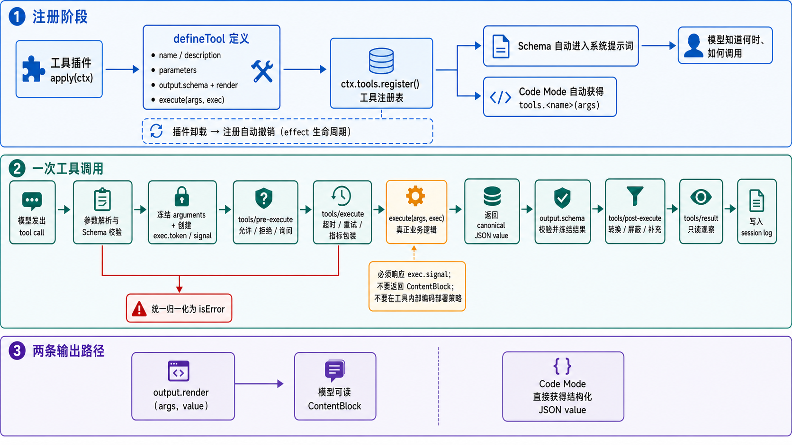

# 从原理到实现：开发第一个 DeepSeek Harness 工具插件

dsh一切皆插件，咱们从工具插件入手，去分析这些插件的工作原理，帮助我们更好的去使用dsh。

1. 本教程会带你开发一个可以被模型调用的 `greet` 工具。完成后，你将理解插件如何接入 Harness、模型为什么能够发现工具、工具调用经过哪些处理阶段，以及 `execute` 和 `output.render` 的职责。

## 了解架构设计



## 最终效果

用户向模型发送：

```text
使用 greet 工具问候 morris。
```

模型调用：

```json
{
  "name": "greet",
  "arguments": {
    "name": "morris"
  }
}
```

工具返回结构化结果：

```json
"Hello, morris!"
```

模型看到经过 `output.render()` 转换的内容，并向用户回答问候结果。

## 开始之前

你需要：

- Node.js 和 pnpm。
- 已经执行过 `pnpm install`。
- 能从源码启动 DeepSeek Harness。
- 已配置可用的模型 Provider。
- 对 TypeScript 有基本了解。

本教程使用临时目录 `scratch-plugin`，不会修改 Harness 的默认插件组合。

## 一、先理解工具插件的运行原理

工具插件不是由模型直接调用的普通函数。它先向 `ctx.tools` 注册一份工具定义，之后由 Harness 负责发现、校验、调度、记录和展示。

DeepSeek Harness 工具插件架构图

整个过程可以分为注册和调用两个阶段。

### 注册阶段

```text
插件加载
→ defineTool 定义工具
→ ctx.tools.register() 注册
→ Schema 加入系统提示词
→ 模型获得工具名称、说明和参数定义
```

注册成功后：

- 模型可以通过原生 Tool Call 调用工具。
- Code Mode 可以通过 `tools.<name>(args)` 调用工具。
- 插件卸载时，工具注册会自动撤销。


### 调用阶段

```text
模型生成 Tool Call
→ Harness 校验参数
→ 权限和策略插件处理
→ execute() 执行业务逻辑
→ Harness 校验返回值
→ output.render() 生成模型可读内容
→ 调用和结果写入 Session Log
```


### 哪些部分由你实现

你负责：

- `name`
- `description`
- `parameters`
- `output.schema`
- `execute`
- `output.render`

Harness 负责：

- 参数校验
- 调用身份和取消信号
- 权限流水线
- 输出校验
- 错误归一化
- Session Log
- Code Mode 接入
- 插件卸载和资源清理

因此，工具开发的核心任务是定义清晰的输入输出接口，并实现业务逻辑。

## 二、创建插件目录

在仓库根目录执行：

```bash
mkdir -p scratch-plugin/src
```

目录结构如下：

```text
scratch-plugin/
├── cordis.yml
└── src/
    └── greet-tool.ts
```

`greet-tool.ts` 是插件代码，`cordis.yml` 告诉 Harness 如何加载它。

## 三、实现工具插件

创建 `scratch-plugin/src/greet-tool.ts`：

```ts
import type { Context } from '@deepseek-ai/cordis'
import { defineTool } from '@deepseek-ai/dsh-tools'

export const name = 'greet-tool'

export const inject = ['tools']

export function apply(ctx: Context) {
  ctx.tools.register(defineTool({
    name: 'greet',
    description: 'Greet someone by name.',
    parameters: {
      name: {
        type: 'string',
        required: true,
        description: 'The name of the person to greet.',
      },
    },
    output: {
      schema: {
        type: 'string',
      },
      render: (_args, value) => [
        {
          type: 'text',
          text: value,
        },
      ],
    },
    async execute(args) {
      return `Hello, ${args.name}!`
    },
  }))
}
```

下面逐项理解这段代码。

### `name`

```ts
export const name = 'greet-tool'
```

这是 Cordis 插件的名称，不是模型调用的工具名称。模型调用的名称由 `defineTool()` 中的 `name: 'greet'` 决定。

### `inject`

```ts
export const inject = ['tools']
```

`inject` 是 Cordis 读取的插件依赖声明。数组中的元素是 **Context 服务名**，不是模型能够调用的具体工具名。这里的 `'tools'` 对应 `ctx.tools` 工具注册表服务，而 `greet`、`bash`、`read` 才是注册表中的具体工具。

```text
inject 中的服务名       apply 中使用的服务
'tools'                 ctx.tools
'fs'                    ctx.fs
'systemPrompt'          ctx.systemPrompt
```

Cordis 不会分析 `apply()` 并自动推断依赖，因此开发者需要让声明和实际访问保持一致：

```ts
export const inject = ['tools']

export function apply(ctx: Context) {
  ctx.tools.register(/* ... */)
}
```

Cordis 读取 `inject` 后，会检查自己的服务注册表。缺少任意必需服务时，插件保持 `PENDING`，其他插件继续加载；相关服务出现后，Cordis 再次检查并执行 `apply()`。这不是数组自身的行为，也不是阻塞 JavaScript 线程，而是 Cordis 对插件状态的管理。

```text
读取 inject: ['tools']
        ↓
ctx.tools 已经存在？
   ├── 否 → 插件保持 PENDING，不执行 apply()
   └── 是 → 插件变为 ACTIVE，执行 apply(ctx)
```

一个插件可以依赖多个服务。例如，一个模型工具既要向工具注册表注册，又要通过文件系统读取内容：

```ts ignore-check
export const inject = ['tools', 'fs']

export function apply(ctx: Context) {
  ctx.tools.register(defineTool({
    // execute() 可以使用 ctx.fs 读取文件。
  }))
}
```

常见服务包括：


| `inject` 名称    | `ctx` 属性           | 用途             |
| -------------- | ------------------ | -------------- |
| `tools`        | `ctx.tools`        | 注册和执行模型工具      |
| `systemPrompt` | `ctx.systemPrompt` | 注册系统提示词段落      |
| `agents`       | `ctx.agents`       | 创建、查询和管理 Agent |
| `sessions`     | `ctx.sessions`     | 管理会话及其事件日志     |
| `llm`          | `ctx.llm`          | 注册和调用模型适配器     |
| `fs`           | `ctx.fs`           | 读取和修改文件        |
| `shell`        | `ctx.shell`        | 执行 Shell 命令    |
| `skills`       | `ctx.skills`       | 发现和加载 Skill    |
| `commands`     | `ctx.commands`     | 注册用户斜杠命令       |


`inject` 只声明依赖，不负责加载提供这些服务的插件。真正加载哪些插件由 `cordis.yml`、Bundle 或 Agent Preset 决定。如果声明了 `inject = ['tools', 'fs']`，但当前组合没有任何插件提供 `ctx.fs`，该插件会一直保持 `PENDING`，启动诊断会报告未解析的 `fs` 服务。

如果 `tools` 服务在运行期间被卸载，依赖它的插件也会自动卸载，`ctx.tools.register()` 创建的注册会随之清理；服务恢复后，插件重新激活并执行 `apply()`。

### `ctx.tools.register()`

```ts
ctx.tools.register(defineTool({
  // ...
}))
```

这一步将工具注册到 Harness。注册属于插件生命周期，插件卸载时不需要手动调用 `unregister()`。

### `description`

```ts
description: 'Greet someone by name.'
```

这是模型看到的工具说明。模型根据说明决定什么时候调用工具。说明应回答“这个工具做什么”，不要描述内部实现过程。

### `parameters`

```ts
parameters: {
  name: {
    type: 'string',
    required: true,
    description: 'The name of the person to greet.',
  },
}
```

这部分定义模型需要生成的参数。`defineTool` 会同时用它生成模型可见的工具 Schema、推导 TypeScript 参数类型，并执行运行时参数校验。

因此，`execute()` 中的 `args` 会被推导为：

```ts
{
  name: string
}
```

如果模型缺少 `name`，或者传入了错误类型，Harness 会在进入 `execute()` 前拒绝调用。

### `output.schema`

```ts
output: {
  schema: {
    type: 'string',
  },
}
```

它声明 `execute()` 必须返回字符串。如果 `execute()` 返回了不符合 Schema 的值，Harness 会把调用归一化为错误，而不是把无效数据交给模型。

生产工具也可以返回对象：

```ts
output: {
  schema: {
    type: 'object',
    properties: {
      greeting: { type: 'string' },
      language: { type: 'string' },
    },
    required: ['greeting', 'language'],
    additionalProperties: false,
  },
  // ...
}
```

结构化输出应直接包含程序需要的字段，不要要求调用者从自然语言中解析 ID、状态或路径。

### `execute()`

```ts
async execute(args) {
  return `Hello, ${args.name}!`
}
```

`execute()` 实现真正的业务逻辑。它应返回符合 `output.schema` 的结构化值，不要直接返回 `ContentBlock`。

如果工具执行文件、网络或进程操作，还需要接收 `exec` 并响应取消信号：

```ts ignore-check
async execute(args, exec) {
  return await requestRemoteService(args.name, {
    signal: exec.signal,
  })
}
```


### `output.render()`

```ts
render: (_args, value) => [
  {
    type: 'text',
    text: value,
  },
]
```

`execute()` 返回结构化值，`render()` 将它转换成模型可以看到的内容。这两个职责要分开：

```text
execute()       → 程序可用的结构化结果
output.render() → 模型可读的 ContentBlock
```

在 Code Mode 中，程序直接获得结构化值，不需要解析 `render()` 生成的文字。

## 四、把插件挂载到 Harness

先获取仓库绝对路径：

```bash
pwd
```

创建 `scratch-plugin/cordis.yml`，把下面的路径替换成实际绝对路径：

```yaml
- insert:
    - id: greet-tool
      name: '/absolute/path/to/deepseek-harness/scratch-plugin/src/greet-tool.ts'
```

例如：

```yaml
- insert:
    - id: greet-tool
      name: '/Users/morrismo/Desktop/labs/deepseek-harness/scratch-plugin/src/greet-tool.ts'
```

这里有两个不同的名称：


| 字段          | 示例           | 用途                 |
| ----------- | ------------ | ------------------ |
| Loader `id` | `greet-tool` | 配置层定位和覆盖插件行        |
| 工具 `name`   | `greet`      | 模型生成 Tool Call 时使用 |


`id` 应在组合中保持唯一和稳定。

## 五、启动并验证插件

启动 Web 模式：

```bash
pnpm dsh web --patch ./scratch-plugin/cordis.yml
```

这条命令可以拆成五部分理解：


| 部分                            | 作用                                |
| ----------------------------- | --------------------------------- |
| `pnpm`                        | 使用当前项目安装的命令和依赖运行程序。               |
| `dsh`                         | 启动 DeepSeek Harness 命令行程序。        |
| `web`                         | 选择 Web Profile，加载 Web 界面及其默认插件组合。 |
| `--patch`                     | 在默认组合加载完成后，再叠加一份 Cordis 配置补丁。     |
| `./scratch-plugin/cordis.yml` | 补丁文件路径；相对路径以执行命令时所在的目录为起点。        |


这里最重要的是 `--patch`：它不会用 `cordis.yml` 替换 Web Profile，而是把文件中的配置继续叠加到现有组合上。因此，Web Profile 原有的模型、会话、工具注册表和界面仍然存在，同时新增 `greet-tool` 插件。

```text
Web Profile 的默认插件组合
           +
--patch 指定的 cordis.yml
           ↓
最终运行的插件组合
```

`--patch` 后面必须跟一个补丁文件路径。可以多次使用，补丁会按照命令中的先后顺序叠加，后面的补丁可以按插件行的 `id` 覆盖前面的配置：

```bash
pnpm dsh web \
  --patch ./base-extension.yml \
  --patch ./scratch-plugin/cordis.yml
```

本教程只需要一个补丁。由于命令是在项目根目录执行的，所以 `./scratch-plugin/cordis.yml` 指向项目根目录下的对应文件。

打开：

```text
http://127.0.0.1:3080
```

向模型发送：

```text
请使用 greet 工具问候 morris。
```

预期流程：

1. 模型发现 `greet` 工具。
2. 模型生成包含 `name: "morris"` 的 Tool Call。
3. Harness 校验参数。
4. `execute()` 返回 `"Hello, morris!"`。
5. Harness 校验返回值。
6. `output.render()` 生成文本内容。
7. 模型根据工具结果回答用户。

如果模型只在自然语言中回答而没有调用工具，请明确要求它使用 `greet` 工具。工具说明影响模型决策，但不强制模型调用。

## 六、观察工具流水线

工具注册本身是一种扩展，工具执行流水线也提供扩展点。下面增加一个只读日志插件，观察所有工具的最终结果。

创建 `scratch-plugin/src/tool-logger.ts`：

```ts
import type { Context } from '@deepseek-ai/cordis'
import '@deepseek-ai/dsh-tools'

export const name = 'tool-logger'

export function apply(ctx: Context) {
  ctx.on('tools/result', (exec, result) => {
    console.log('[tool result]', {
      name: exec.name,
      arguments: exec.arguments,
      isError: result.isError,
    })
  })
}
```


### 为什么 `tool-logger` 没有声明 `inject = ['tools']`

`tool-logger` 没有访问 `ctx.tools`，它调用的是 Cordis Context 自带的事件 API：

```ts
ctx.on('tools/result', handler)
```

这里的 `tools/result` 是事件名称，`tools` 只是事件的命名空间，不等于 `ctx.tools` 服务。`ctx.on()`、`ctx.emit()` 和 `ctx.effect()` 都是 Context 的基础能力，不需要通过 `inject` 注入。

```text
ctx.tools.register(...)
→ 访问 tools 服务
→ 必须声明 inject = ['tools']

ctx.on('tools/result', ...)
→ 向 Cordis 事件总线注册监听器
→ 不要求 ctx.tools 服务存在
```

文件顶部的这行导入：

```ts
import '@deepseek-ai/dsh-tools'
```

作用是让 TypeScript 获得 `tools/result` 事件的参数类型。它不会挂载工具插件，也不会提供 `ctx.tools` 服务。如果当前插件组合中没有工具服务，`tool-logger` 仍然可以激活，只是没有插件发出 `tools/result` 事件，因此监听函数不会执行。

如果 logger 还要主动读取工具注册表，就需要声明 `tools` 依赖。例如：

```ts
import type { Context } from '@deepseek-ai/cordis'
import '@deepseek-ai/dsh-tools'

export const name = 'tool-logger'
export const inject = ['tools']

export function apply(ctx: Context) {
  ctx.on('tools/result', (exec) => {
    const definition = ctx.tools.get(exec.name, exec.agent)
    console.log('[tool definition]', definition)
  })
}
```

可以用下面的规则判断：

```text
只使用 ctx.on('tools/...') → 不一定依赖 tools 服务
使用 ctx.tools.xxx()       → 必须声明 inject = ['tools']
```

更新 `scratch-plugin/cordis.yml`：

```yaml
- insert:
    - id: greet-tool
      name: '/Users/morrismo/Desktop/labs/deepseek-harness/scratch-plugin/src/greet-tool.ts'

    - id: tool-logger
      name: '/Users/morrismo/Desktop/labs/deepseek-harness/scratch-plugin/src/tool-logger.ts'
```

重新调用 `greet` 后，终端会打印工具名称、参数和错误状态。

`tools/result` 是只读观察点，适合审计、指标统计、调试日志和调用追踪。如果需要改变执行行为，应选择其他扩展点：


| 扩展点                  | 适合的功能          |
| -------------------- | -------------- |
| `tools/pre-execute`  | 允许、拒绝或请求批准     |
| `ctx.tools.guard()`  | 不可被后续策略解除的最终拒绝 |
| `tools/execute`      | 超时、重试、指标和调用包装  |
| `tools/post-execute` | 修改、屏蔽或补充结果     |
| `tools/result`       | 只读观察最终结果       |


`tools/pre-execute`、`tools/execute` 和 `tools/post-execute` 是 waterfall 事件。监听器要继续执行下游逻辑时，必须调用 `next()`；不调用会短路流水线。